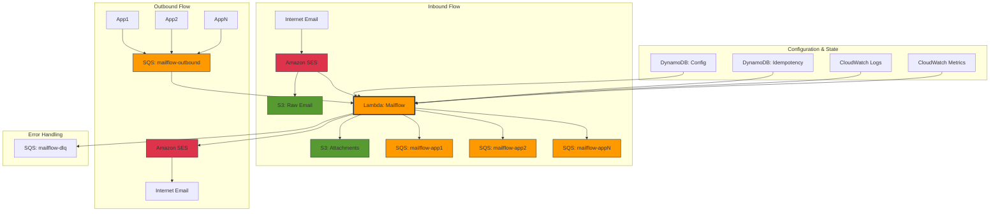
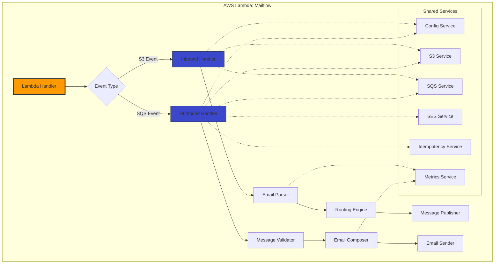
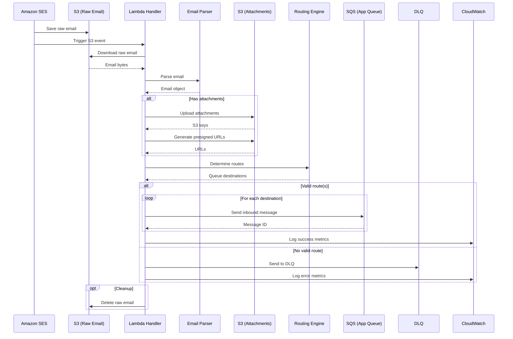
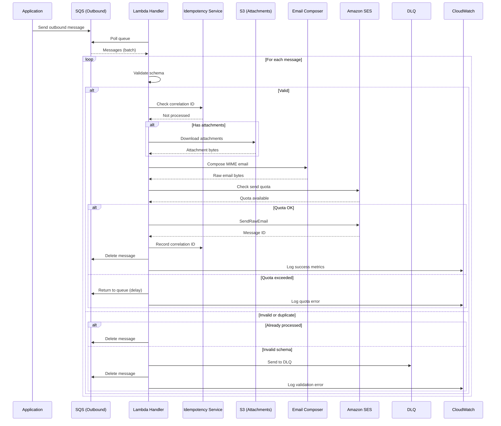
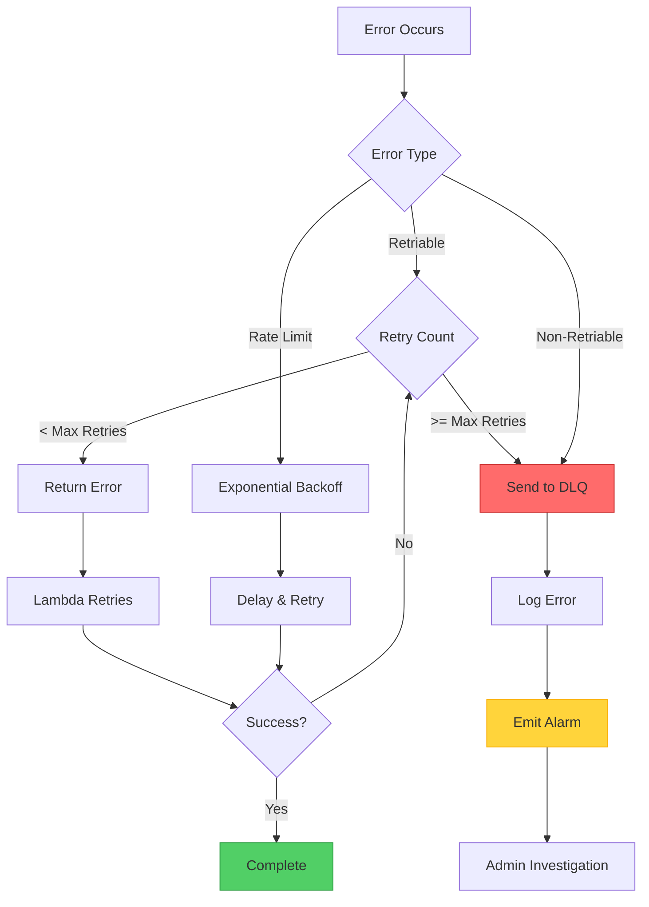
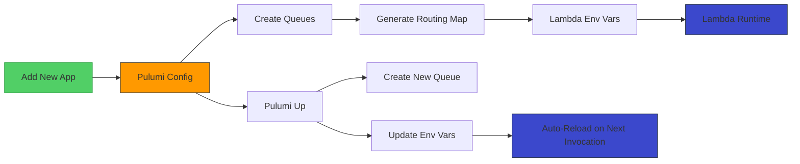
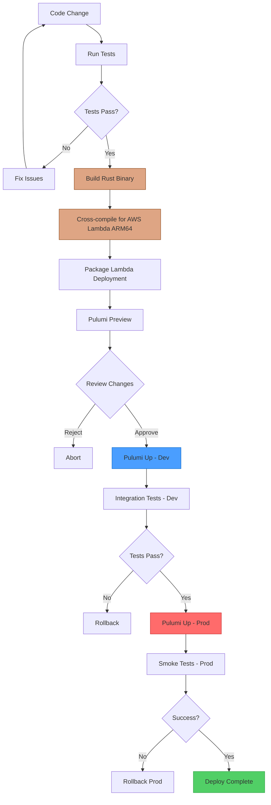

# Design Specification: Mailflow - Email Dispatching System

**Version:** 1.0
**Date:** 2025-10-31
**Status:** Draft
**Based on:** [0001-spec.md](./0001-spec.md)

## 1. Overview

This document describes the technical design for the Mailflow email dispatching system using Rust and AWS Lambda. The system is implemented as a single Rust binary deployed to AWS Lambda, handling both inbound email routing and outbound email sending.

### 1.0 Key Design Decisions

**Infrastructure-as-Code Configuration** (No DynamoDB Config Table):
- Queue creation and routing configuration managed entirely through Pulumi
- Routing map injected as JSON via Lambda environment variables
- Adding new apps requires only Pulumi config update + deployment
- Benefits: Simpler, cheaper, safer (version-controlled), faster (no runtime DB queries)
- Only DynamoDB table needed: Idempotency tracking

### 1.1 Technology Stack

- **Language**: Rust (2024 edition)
- **Runtime**: AWS Lambda Custom Runtime (Rust)
- **Email Parsing**: `mail-parser`
- **Email Sending**: `lettre`
- **AWS SDK**: `aws-sdk-rust` (S3, SQS, SES, DynamoDB, etc.)
- **Async Runtime**: `tokio`
- **Serialization**: `serde`, `serde_json`
- **Infrastructure**: Pulumi (TypeScript)
- **Error Handling**: `thiserror`, `anyhow`
- **Logging**: `tracing`
- **Configuration**: `config`

### 1.2 Design Principles

1. **Single Binary**: One Rust binary handles both inbound and outbound processing
2. **Event-Driven**: React to SES events and SQS messages
3. **Stateless**: No persistent state in Lambda, configuration from DynamoDB/S3
4. **Idempotent**: All operations designed for at-least-once delivery
5. **Fail-Safe**: Comprehensive error handling with DLQ fallback
6. **Observable**: Structured logging and metrics throughout
7. **Type-Safe**: Leverage Rust's type system for correctness

## 2. System Architecture

### 2.1 High-Level Architecture



### 2.2 Lambda Function Architecture



## 3. Module Design

### 3.1 Crate Structure

```
mailflow/
├── Cargo.toml
├── src/
│   ├── lib.rs                    # Library root
│   ├── main.rs                   # Lambda entrypoint
│   │
│   ├── handlers/
│   │   ├── mod.rs
│   │   ├── inbound.rs            # Inbound email handler
│   │   └── outbound.rs           # Outbound email handler
│   │
│   ├── services/
│   │   ├── mod.rs
│   │   ├── config.rs             # Configuration service
│   │   ├── s3.rs                 # S3 operations
│   │   ├── sqs.rs                # SQS operations
│   │   ├── ses.rs                # SES operations
│   │   ├── idempotency.rs        # Idempotency tracking
│   │   └── metrics.rs            # Metrics and logging
│   │
│   ├── email/
│   │   ├── mod.rs
│   │   ├── parser.rs             # Email parsing (mail-parser)
│   │   ├── composer.rs           # Email composition (lettre)
│   │   ├── attachment.rs         # Attachment handling
│   │   └── mime.rs               # MIME utilities
│   │
│   ├── routing/
│   │   ├── mod.rs
│   │   ├── engine.rs             # Routing logic
│   │   ├── rules.rs              # Routing rules
│   │   └── resolver.rs           # Queue resolution
│   │
│   ├── models/
│   │   ├── mod.rs
│   │   ├── events.rs             # AWS event types
│   │   ├── messages.rs           # Message schemas
│   │   ├── config.rs             # Configuration models
│   │   └── email.rs              # Email domain models
│   │
│   ├── error.rs                  # Error types
│   └── utils/
│       ├── mod.rs
│       ├── validation.rs         # Input validation
│       └── sanitization.rs       # Content sanitization
│
├── tests/
│   ├── integration/
│   │   ├── inbound_flow.rs
│   │   └── outbound_flow.rs
│   └── fixtures/
│       └── sample_emails/
│
└── benches/
    └── email_parsing.rs
```

### 3.2 Module Responsibilities

#### 3.2.1 Handlers Module

**Purpose**: Process Lambda events and coordinate workflow

**`handlers::inbound`**

- Parse S3 event notifications from SES
- Download raw email from S3
- Invoke email parser
- Determine routing destination(s)
- Publish messages to target queues
- Handle errors and DLQ

**`handlers::outbound`**

- Poll SQS outbound queue
- Validate message schema
- Check idempotency
- Compose email
- Send via SES
- Track delivery status

#### 3.2.2 Services Module

**Purpose**: Provide reusable infrastructure interactions

**`services::config`**

- Load configuration from DynamoDB or S3
- Cache configuration in memory
- Refresh on TTL expiration
- Validate configuration schema

**`services::s3`**

- Upload/download objects
- Generate presigned URLs
- Manage object lifecycle
- Handle multipart uploads for large attachments

**`services::sqs`**

- Send messages (single and batch)
- Receive messages with long polling
- Delete messages
- Handle visibility timeout

**`services::ses`**

- Send raw emails via SendRawEmail
- Query sending quotas
- Handle rate limiting
- Process bounce/complaint notifications

**`services::idempotency`**

- Store correlation IDs in DynamoDB
- Check for duplicate processing
- Implement TTL-based cleanup

**`services::metrics`**

- Emit CloudWatch metrics
- Structured logging
- Distributed tracing (X-Ray)
- Performance instrumentation

#### 3.2.3 Email Module

**Purpose**: Email parsing, composition, and manipulation

**`email::parser`**

- Parse MIME emails using `mail-parser`
- Extract headers, body, attachments
- Handle character encodings
- Validate email structure

**`email::composer`**

- Build MIME emails using `lettre`
- Create multipart/alternative structure
- Encode attachments
- Set standard headers

**`email::attachment`**

- Extract attachments from parsed emails
- Upload to S3
- Download from S3
- Generate presigned URLs
- Validate file types and sizes

**`email::mime`**

- MIME type detection
- Content encoding/decoding
- Header parsing utilities
- RFC 5322 compliance

#### 3.2.4 Routing Module

**Purpose**: Determine message destinations

**`routing::engine`**

- Extract app name from recipient
- Match against routing rules
- Support multiple recipients
- Handle fallback queues

**`routing::rules`**

- Load routing configuration
- Pattern matching (regex, exact, prefix)
- Queue validation
- Alias resolution

**`routing::resolver`**

- Resolve queue URLs
- Check queue existence
- Handle default/unknown queues

## 4. Data Models

### 4.1 Core Domain Models

```rust
// src/models/email.rs

/// Parsed email representation
pub struct Email {
    pub message_id: String,
    pub from: EmailAddress,
    pub to: Vec<EmailAddress>,
    pub cc: Vec<EmailAddress>,
    pub bcc: Vec<EmailAddress>,
    pub reply_to: Option<EmailAddress>,
    pub subject: String,
    pub body: EmailBody,
    pub attachments: Vec<Attachment>,
    pub headers: EmailHeaders,
    pub received_at: DateTime<Utc>,
}

pub struct EmailAddress {
    pub address: String,
    pub name: Option<String>,
}

pub struct EmailBody {
    pub text: Option<String>,
    pub html: Option<String>,
}

pub struct Attachment {
    pub filename: String,
    pub content_type: String,
    pub size: usize,
    pub s3_bucket: String,
    pub s3_key: String,
    pub presigned_url: Option<String>,
    pub presigned_url_expiration: Option<DateTime<Utc>>,
}

pub struct EmailHeaders {
    pub in_reply_to: Option<String>,
    pub references: Vec<String>,
    pub custom: HashMap<String, String>,
}
```

### 4.2 Message Schemas

```rust
// src/models/messages.rs

/// Message sent to app queues (inbound)
#[derive(Serialize, Deserialize)]
pub struct InboundMessage {
    pub version: String,
    pub message_id: String,
    pub timestamp: DateTime<Utc>,
    pub source: String,
    pub email: InboundEmail,
    pub metadata: MessageMetadata,
}

#[derive(Serialize, Deserialize)]
pub struct InboundEmail {
    pub message_id: String,
    pub from: EmailAddressDto,
    pub to: Vec<EmailAddressDto>,
    pub cc: Vec<EmailAddressDto>,
    pub reply_to: Option<EmailAddressDto>,
    pub subject: String,
    pub body: EmailBodyDto,
    pub attachments: Vec<AttachmentDto>,
    pub headers: EmailHeadersDto,
    pub received_at: DateTime<Utc>,
}

#[derive(Serialize, Deserialize)]
pub struct MessageMetadata {
    pub routing_key: String,
    pub domain: String,
    pub spam_score: f32,
    pub dkim_verified: bool,
    pub spf_verified: bool,
}

/// Message received from outbound queue
#[derive(Serialize, Deserialize)]
pub struct OutboundMessage {
    pub version: String,
    pub correlation_id: String,
    pub timestamp: DateTime<Utc>,
    pub source: String,
    pub email: OutboundEmail,
    pub options: SendOptions,
}

#[derive(Serialize, Deserialize)]
pub struct OutboundEmail {
    pub from: EmailAddressDto,
    pub to: Vec<EmailAddressDto>,
    pub cc: Vec<EmailAddressDto>,
    pub bcc: Vec<EmailAddressDto>,
    pub reply_to: Option<EmailAddressDto>,
    pub subject: String,
    pub body: EmailBodyDto,
    pub attachments: Vec<OutboundAttachmentDto>,
    pub headers: EmailHeadersDto,
}

#[derive(Serialize, Deserialize)]
pub struct SendOptions {
    pub priority: Priority,
    pub scheduled_send_time: Option<DateTime<Utc>>,
    pub track_opens: bool,
    pub track_clicks: bool,
}

#[derive(Serialize, Deserialize)]
pub enum Priority {
    High,
    Normal,
    Low,
}
```

### 4.3 Configuration Models

```rust
// src/models/config.rs

/// System configuration
#[derive(Deserialize, Clone)]
pub struct MailflowConfig {
    pub version: String,
    pub domains: Vec<String>,
    pub routing: HashMap<String, AppRouting>,
    pub default_queue: String,
    pub unknown_queue: String,
    pub attachments: AttachmentConfig,
    pub security: SecurityConfig,
    pub retention: RetentionConfig,
}

#[derive(Deserialize, Clone)]
pub struct AppRouting {
    pub queue_url: String,
    pub enabled: bool,
    pub aliases: Vec<String>,
}

#[derive(Deserialize, Clone)]
pub struct AttachmentConfig {
    pub bucket: String,
    pub presigned_url_expiration: u64,
    pub max_size: usize,
    pub allowed_types: Vec<String>,
    pub blocked_types: Vec<String>,
    pub scan_for_malware: bool,
}

#[derive(Deserialize, Clone)]
pub struct SecurityConfig {
    pub require_spf: bool,
    pub require_dkim: bool,
    pub require_dmarc: bool,
    pub max_emails_per_sender_per_hour: u32,
}

#[derive(Deserialize, Clone)]
pub struct RetentionConfig {
    pub raw_emails: u32,
    pub attachments: u32,
    pub logs: u32,
}
```

### 4.4 Event Models

```rust
// src/models/events.rs

/// Lambda event wrapper
#[derive(Deserialize)]
#[serde(untagged)]
pub enum LambdaEvent {
    S3(S3Event),
    Sqs(SqsEvent),
}

/// S3 event from SES
#[derive(Deserialize)]
pub struct S3Event {
    #[serde(rename = "Records")]
    pub records: Vec<S3EventRecord>,
}

#[derive(Deserialize)]
pub struct S3EventRecord {
    pub s3: S3Info,
    pub ses: Option<SesInfo>,
}

#[derive(Deserialize)]
pub struct S3Info {
    pub bucket: S3Bucket,
    pub object: S3Object,
}

#[derive(Deserialize)]
pub struct SesInfo {
    pub mail: SesMail,
    pub receipt: SesReceipt,
}

/// SQS event for outbound processing
#[derive(Deserialize)]
pub struct SqsEvent {
    #[serde(rename = "Records")]
    pub records: Vec<SqsRecord>,
}

#[derive(Deserialize)]
pub struct SqsRecord {
    pub message_id: String,
    pub receipt_handle: String,
    pub body: String,
    pub attributes: HashMap<String, String>,
}
```

## 5. High-Level Interfaces

### 5.1 Core Traits

```rust
// src/lib.rs or appropriate module

/// Email parsing trait
#[async_trait]
pub trait EmailParser: Send + Sync {
    async fn parse(&self, raw_email: &[u8]) -> Result<Email, EmailError>;
    async fn extract_attachments(&self, email: &Email) -> Result<Vec<Attachment>, EmailError>;
}

/// Email composition trait
#[async_trait]
pub trait EmailComposer: Send + Sync {
    async fn compose(&self, email: &OutboundEmail) -> Result<Vec<u8>, EmailError>;
    async fn add_attachments(&self, message: &mut Vec<u8>, attachments: &[Attachment]) -> Result<(), EmailError>;
}

/// Routing engine trait
#[async_trait]
pub trait Router: Send + Sync {
    async fn route(&self, email: &Email) -> Result<Vec<RouteDestination>, RoutingError>;
    async fn resolve_queue(&self, app_name: &str) -> Result<String, RoutingError>;
}

/// Configuration provider trait
#[async_trait]
pub trait ConfigProvider: Send + Sync {
    async fn get_config(&self) -> Result<MailflowConfig, ConfigError>;
    async fn refresh(&self) -> Result<(), ConfigError>;
}

/// Storage service trait (S3)
#[async_trait]
pub trait StorageService: Send + Sync {
    async fn upload(&self, bucket: &str, key: &str, data: &[u8]) -> Result<(), StorageError>;
    async fn download(&self, bucket: &str, key: &str) -> Result<Vec<u8>, StorageError>;
    async fn generate_presigned_url(&self, bucket: &str, key: &str, expiration: Duration) -> Result<String, StorageError>;
    async fn delete(&self, bucket: &str, key: &str) -> Result<(), StorageError>;
}

/// Queue service trait (SQS)
#[async_trait]
pub trait QueueService: Send + Sync {
    async fn send_message(&self, queue_url: &str, message: &str) -> Result<String, QueueError>;
    async fn send_batch(&self, queue_url: &str, messages: &[String]) -> Result<Vec<String>, QueueError>;
    async fn receive_messages(&self, queue_url: &str, max_messages: i32) -> Result<Vec<SqsRecord>, QueueError>;
    async fn delete_message(&self, queue_url: &str, receipt_handle: &str) -> Result<(), QueueError>;
}

/// Email sending service trait (SES)
#[async_trait]
pub trait EmailSender: Send + Sync {
    async fn send_raw_email(&self, raw_email: &[u8], from: &str, to: &[String]) -> Result<String, SesError>;
    async fn get_send_quota(&self) -> Result<SendQuota, SesError>;
}

/// Idempotency service trait
#[async_trait]
pub trait IdempotencyService: Send + Sync {
    async fn check(&self, correlation_id: &str) -> Result<bool, IdempotencyError>;
    async fn record(&self, correlation_id: &str, ttl: Duration) -> Result<(), IdempotencyError>;
}

/// Metrics service trait
pub trait MetricsService: Send + Sync {
    fn record_counter(&self, name: &str, value: f64, dimensions: &[(&str, &str)]);
    fn record_histogram(&self, name: &str, value: f64, dimensions: &[(&str, &str)]);
    fn record_processing_time<F, T>(&self, operation: &str, f: F) -> T
    where
        F: FnOnce() -> T;
}
```

### 5.2 Handler Interfaces

```rust
// src/handlers/mod.rs

/// Main Lambda handler
pub async fn handler(event: LambdaEvent, ctx: Context) -> Result<(), Error> {
    match event {
        LambdaEvent::S3(s3_event) => inbound::handle(s3_event, ctx).await,
        LambdaEvent::Sqs(sqs_event) => outbound::handle(sqs_event, ctx).await,
    }
}

// src/handlers/inbound.rs

/// Process inbound S3 event from SES
pub async fn handle(event: S3Event, ctx: Context) -> Result<(), Error> {
    // High-level flow:
    // 1. Extract S3 object key from event
    // 2. Download raw email from S3
    // 3. Parse email
    // 4. Process attachments (upload to S3)
    // 5. Determine routing
    // 6. Construct inbound messages
    // 7. Send to target queues
    // 8. Log metrics
    // 9. Clean up raw email (optional)
}

// src/handlers/outbound.rs

/// Process outbound SQS messages
pub async fn handle(event: SqsEvent, ctx: Context) -> Result<(), Error> {
    // High-level flow:
    // 1. For each SQS record:
    //    a. Parse message body
    //    b. Validate schema
    //    c. Check idempotency
    //    d. Download attachments from S3
    //    e. Compose MIME email
    //    f. Check SES quota
    //    g. Send via SES
    //    h. Record idempotency
    //    i. Delete from queue
    //    j. Log metrics
    // 2. Handle errors (DLQ)
}
```

## 6. Data Flow

### 6.1 Inbound Email Processing Flow



### 6.2 Outbound Email Processing Flow



### 6.3 Error Handling Flow



## 7. Implementation Strategy

### 7.1 Dependency Injection Pattern

```rust
// src/lib.rs

pub struct MailflowApp {
    config: Arc<dyn ConfigProvider>,
    storage: Arc<dyn StorageService>,
    queue: Arc<dyn QueueService>,
    ses: Arc<dyn EmailSender>,
    parser: Arc<dyn EmailParser>,
    composer: Arc<dyn EmailComposer>,
    router: Arc<dyn Router>,
    idempotency: Arc<dyn IdempotencyService>,
    metrics: Arc<dyn MetricsService>,
}

impl MailflowApp {
    pub fn new() -> Result<Self, Error> {
        // Initialize AWS SDK clients
        // Create service implementations
        // Wire dependencies
    }

    pub async fn handle_inbound(&self, event: S3Event) -> Result<(), Error> {
        // Delegate to inbound handler
    }

    pub async fn handle_outbound(&self, event: SqsEvent) -> Result<(), Error> {
        // Delegate to outbound handler
    }
}
```

### 7.2 Error Handling Strategy

```rust
// src/error.rs

#[derive(thiserror::Error, Debug)]
pub enum MailflowError {
    #[error("Email parsing error: {0}")]
    EmailParsing(#[from] EmailParseError),

    #[error("Routing error: {0}")]
    Routing(#[from] RoutingError),

    #[error("Storage error: {0}")]
    Storage(#[from] StorageError),

    #[error("Queue error: {0}")]
    Queue(#[from] QueueError),

    #[error("SES error: {0}")]
    Ses(#[from] SesError),

    #[error("Configuration error: {0}")]
    Config(#[from] ConfigError),

    #[error("Validation error: {0}")]
    Validation(String),

    #[error("Idempotency error: {0}")]
    Idempotency(#[from] IdempotencyError),
}

impl MailflowError {
    pub fn is_retriable(&self) -> bool {
        match self {
            Self::Storage(_) => true,
            Self::Queue(_) => true,
            Self::Ses(e) => e.is_retriable(),
            Self::Config(_) => false,
            Self::Validation(_) => false,
            _ => false,
        }
    }
}
```

### 7.3 Configuration Loading

Configuration is loaded from environment variables (set by Pulumi during deployment):

```rust
// src/services/config.rs

use std::collections::HashMap;

pub struct EnvConfigProvider {
    config: MailflowConfig,
}

impl EnvConfigProvider {
    pub fn new() -> Result<Self, ConfigError> {
        let routing_map_json = std::env::var("ROUTING_MAP")
            .map_err(|_| ConfigError::MissingEnvVar("ROUTING_MAP"))?;

        let routing_map: HashMap<String, String> = serde_json::from_str(&routing_map_json)
            .map_err(|e| ConfigError::InvalidJson(e.to_string()))?;

        let allowed_domains = std::env::var("ALLOWED_DOMAINS")
            .unwrap_or_default()
            .split(',')
            .map(|s| s.trim().to_string())
            .collect();

        let config = MailflowConfig {
            version: "1.0".to_string(),
            domains: allowed_domains,
            routing: routing_map.into_iter().map(|(app, queue_url)| {
                (app.clone(), AppRouting {
                    queue_url,
                    enabled: true,
                    aliases: vec![],
                })
            }).collect(),
            default_queue: std::env::var("DEFAULT_QUEUE_URL")
                .unwrap_or_default(),
            unknown_queue: std::env::var("DEFAULT_QUEUE_URL")
                .unwrap_or_default(),
            attachments: AttachmentConfig {
                bucket: std::env::var("RAW_EMAILS_BUCKET")?,
                presigned_url_expiration: 604800, // 7 days
                max_size: 36700160, // 35 MB
                allowed_types: vec![],
                blocked_types: vec!["application/x-executable".to_string()],
                scan_for_malware: false,
            },
            security: SecurityConfig {
                require_spf: false,
                require_dkim: false,
                require_dmarc: false,
                max_emails_per_sender_per_hour: 100,
            },
            retention: RetentionConfig {
                raw_emails: 7,
                attachments: 30,
                logs: 30,
            },
        };

        Ok(Self { config })
    }
}

#[async_trait]
impl ConfigProvider for EnvConfigProvider {
    async fn get_config(&self) -> Result<MailflowConfig, ConfigError> {
        // Configuration is immutable during Lambda lifetime
        Ok(self.config.clone())
    }

    async fn refresh(&self) -> Result<(), ConfigError> {
        // No-op: config is loaded once at startup
        Ok(())
    }
}

// Initialize config at Lambda startup
lazy_static! {
    static ref CONFIG: EnvConfigProvider = EnvConfigProvider::new()
        .expect("Failed to load configuration from environment");
}
```

### 7.4 Idempotency Implementation

```rust
// src/services/idempotency.rs

pub struct DynamoDbIdempotencyService {
    client: DynamoDbClient,
    table_name: String,
}

#[async_trait]
impl IdempotencyService for DynamoDbIdempotencyService {
    async fn check(&self, correlation_id: &str) -> Result<bool, IdempotencyError> {
        // Query DynamoDB for correlation_id
        // Return true if exists, false otherwise
        let result = self.client
            .get_item()
            .table_name(&self.table_name)
            .key("correlation_id", AttributeValue::S(correlation_id.to_string()))
            .send()
            .await?;

        Ok(result.item.is_some())
    }

    async fn record(&self, correlation_id: &str, ttl: Duration) -> Result<(), IdempotencyError> {
        // Insert correlation_id with TTL
        let ttl_timestamp = (Utc::now() + ttl).timestamp();

        self.client
            .put_item()
            .table_name(&self.table_name)
            .item("correlation_id", AttributeValue::S(correlation_id.to_string()))
            .item("ttl", AttributeValue::N(ttl_timestamp.to_string()))
            .item("processed_at", AttributeValue::S(Utc::now().to_rfc3339()))
            .send()
            .await?;

        Ok(())
    }
}
```

### 7.5 Metrics and Observability

```rust
// src/services/metrics.rs

pub struct CloudWatchMetricsService {
    namespace: String,
    environment: String,
}

impl MetricsService for CloudWatchMetricsService {
    fn record_counter(&self, name: &str, value: f64, dimensions: &[(&str, &str)]) {
        // Emit CloudWatch metric
        tracing::info!(
            target: "metrics",
            metric = name,
            value = value,
            ?dimensions,
            "Counter metric"
        );
    }

    fn record_histogram(&self, name: &str, value: f64, dimensions: &[(&str, &str)]) {
        // Emit CloudWatch metric
        tracing::info!(
            target: "metrics",
            metric = name,
            value = value,
            ?dimensions,
            "Histogram metric"
        );
    }

    fn record_processing_time<F, T>(&self, operation: &str, f: F) -> T
    where
        F: FnOnce() -> T,
    {
        let start = Instant::now();
        let result = f();
        let duration = start.elapsed();

        self.record_histogram(
            &format!("{}_duration_ms", operation),
            duration.as_millis() as f64,
            &[("environment", &self.environment)],
        );

        result
    }
}
```

## 8. Infrastructure Design (Pulumi)

### 8.1 Configuration Strategy

**Key Insight**: Since queue creation is managed through Pulumi/IaC, we don't need a separate DynamoDB config table. The routing configuration is derived directly from the infrastructure:

1. **App Queues**: Created declaratively in Pulumi config
2. **Queue Discovery**: Lambda gets queue URLs via environment variables (JSON map)
3. **No Runtime Config**: Configuration is "baked in" during deployment
4. **Update Process**: Add new app → Update Pulumi config → Deploy (automatic Lambda env var update)

This approach is:
- **Simpler**: No extra DynamoDB table to manage
- **Cheaper**: One less service to pay for (saves ~$1-2/month per table)
- **Safer**: Configuration is version-controlled with infrastructure
- **Faster**: No runtime DB queries needed (eliminates 20-50ms latency per request)
- **Atomic**: Config and infrastructure updated together (no drift)



**Configuration Flow**:
```
Developer → Pulumi Config (Git) → pulumi up → AWS Resources
                                              ├─ SQS Queues
                                              ├─ Lambda Env Vars
                                              └─ IAM Policies
                                                     ↓
                                              Lambda reads ROUTING_MAP
                                                     ↓
                                              Routes emails to queues
```

### 8.2 Infrastructure Components

```typescript
// infra/index.ts (Pulumi TypeScript)

import * as pulumi from "@pulumi/pulumi";
import * as aws from "@pulumi/aws";

// Configuration: Define apps and their queues
const appConfig = {
    app1: { enabled: true },
    app2: { enabled: true },
    invoices: { enabled: true },
};

// S3 Bucket for raw emails and attachments
const rawEmailsBucket = new aws.s3.Bucket("mailflow-raw-emails", {
    lifecycleRules: [{
        enabled: true,
        expiration: { days: 7 },
    }],
    serverSideEncryptionConfiguration: {
        rule: {
            applyServerSideEncryptionByDefault: {
                sseAlgorithm: "aws:kms",
            },
        },
    },
});

// Create app-specific queues dynamically
const appQueues: Record<string, aws.sqs.Queue> = {};
const appQueueUrls: Record<string, pulumi.Output<string>> = {};

for (const [appName, config] of Object.entries(appConfig)) {
    if (config.enabled) {
        const queue = new aws.sqs.Queue(`mailflow-${appName}`, {
            visibilityTimeoutSeconds: 300,
            messageRetentionSeconds: 1209600, // 14 days
            receiveWaitTimeSeconds: 20,
        });
        appQueues[appName] = queue;
        appQueueUrls[appName] = queue.url;
    }
}

// Outbound queue (shared by all apps)
const outboundQueue = new aws.sqs.Queue("mailflow-outbound", {
    visibilityTimeoutSeconds: 300,
    messageRetentionSeconds: 1209600,
    receiveWaitTimeSeconds: 20,
});

// Dead letter queue
const dlq = new aws.sqs.Queue("mailflow-dlq", {
    messageRetentionSeconds: 1209600,
});

// Default queue (for emails not matching any app pattern)
const defaultQueue = new aws.sqs.Queue("mailflow-default", {
    visibilityTimeoutSeconds: 300,
    messageRetentionSeconds: 1209600,
});

// DynamoDB Table for idempotency only
const idempotencyTable = new aws.dynamodb.Table("mailflow-idempotency", {
    attributes: [
        { name: "correlation_id", type: "S" },
    ],
    hashKey: "correlation_id",
    billingMode: "PAY_PER_REQUEST",
    ttl: {
        enabled: true,
        attributeName: "ttl",
    },
});

// Lambda IAM Role
const lambdaRole = new aws.iam.Role("mailflow-lambda-role", {
    assumeRolePolicy: aws.iam.assumeRolePolicyForPrincipal({
        Service: "lambda.amazonaws.com",
    }),
});

// Build SQS resource ARNs for IAM policy
const allQueueArns = [
    outboundQueue.arn,
    dlq.arn,
    defaultQueue.arn,
    ...Object.values(appQueues).map(q => q.arn),
];

// Lambda IAM Policy
const lambdaPolicy = new aws.iam.RolePolicy("mailflow-lambda-policy", {
    role: lambdaRole.id,
    policy: pulumi.all(allQueueArns).apply(arns => ({
        Version: "2012-10-17",
        Statement: [
            {
                Effect: "Allow",
                Action: ["s3:GetObject", "s3:PutObject", "s3:DeleteObject"],
                Resource: pulumi.interpolate`${rawEmailsBucket.arn}/*`,
            },
            {
                Effect: "Allow",
                Action: ["sqs:SendMessage", "sqs:ReceiveMessage", "sqs:DeleteMessage"],
                Resource: arns,
            },
            {
                Effect: "Allow",
                Action: ["ses:SendRawEmail", "ses:GetSendQuota"],
                Resource: "*",
            },
            {
                Effect: "Allow",
                Action: ["dynamodb:GetItem", "dynamodb:PutItem", "dynamodb:Query"],
                Resource: idempotencyTable.arn,
            },
            {
                Effect: "Allow",
                Action: ["logs:CreateLogGroup", "logs:CreateLogStream", "logs:PutLogEvents"],
                Resource: "*",
            },
        ],
    })),
});

// Build routing map as JSON string for environment variable
const routingMapJson = pulumi.all(appQueueUrls).apply(urls =>
    JSON.stringify(urls)
);

// Lambda Function
const lambdaFunction = new aws.lambda.Function("mailflow", {
    runtime: "provided.al2023",
    handler: "bootstrap",
    role: lambdaRole.arn,
    timeout: 60,
    memorySize: 256,
    code: new pulumi.asset.FileArchive("../target/lambda/mailflow/bootstrap.zip"),
    environment: {
        variables: {
            RUST_LOG: "info",
            ROUTING_MAP: routingMapJson,  // JSON map of app -> queue URL
            IDEMPOTENCY_TABLE: idempotencyTable.name,
            RAW_EMAILS_BUCKET: rawEmailsBucket.bucket,
            OUTBOUND_QUEUE_URL: outboundQueue.url,
            DEFAULT_QUEUE_URL: defaultQueue.url,
            DLQ_URL: dlq.url,
            ALLOWED_DOMAINS: "acme.com,example.com",
        },
    },
    deadLetterConfig: {
        targetArn: dlq.arn,
    },
});

// Grant SES permission to invoke Lambda
const sesLambdaPermission = new aws.lambda.Permission("ses-invoke-lambda", {
    action: "lambda:InvokeFunction",
    function: lambdaFunction.name,
    principal: "ses.amazonaws.com",
});

// SES Receipt Rule Set
const sesReceiptRuleSet = new aws.ses.ReceiptRuleSet("mailflow-rules");

const sesActiveRuleSet = new aws.ses.ActiveReceiptRuleSet("mailflow-active", {
    ruleSetName: sesReceiptRuleSet.name,
});

const sesReceiptRule = new aws.ses.ReceiptRule("mailflow-inbound", {
    ruleSetName: sesReceiptRuleSet.name,
    enabled: true,
    recipients: ["acme.com", "example.com"],
    s3Actions: [{
        bucketName: rawEmailsBucket.bucket,
        position: 1,
    }],
    lambdaActions: [{
        functionArn: lambdaFunction.arn,
        position: 2,
        invocationType: "Event",
    }],
});

// SQS Event Source for Lambda (outbound processing)
const sqsEventSource = new aws.lambda.EventSourceMapping("mailflow-outbound-trigger", {
    eventSourceArn: outboundQueue.arn,
    functionName: lambdaFunction.name,
    batchSize: 10,
});

// CloudWatch Alarms
const errorAlarm = new aws.cloudwatch.MetricAlarm("mailflow-errors", {
    comparisonOperator: "GreaterThanThreshold",
    evaluationPeriods: 1,
    metricName: "Errors",
    namespace: "AWS/Lambda",
    period: 300,
    statistic: "Sum",
    threshold: 10,
    dimensions: {
        FunctionName: lambdaFunction.name,
    },
});

const dlqAlarm = new aws.cloudwatch.MetricAlarm("mailflow-dlq-messages", {
    comparisonOperator: "GreaterThanThreshold",
    evaluationPeriods: 1,
    metricName: "ApproximateNumberOfMessagesVisible",
    namespace: "AWS/SQS",
    period: 60,
    statistic: "Average",
    threshold: 0,
    dimensions: {
        QueueName: dlq.name,
    },
});

// Outputs
export const lambdaArn = lambdaFunction.arn;
export const outboundQueueUrl = outboundQueue.url;
export const rawEmailsBucketName = rawEmailsBucket.bucket;
export const appQueueNames = Object.keys(appQueues);
```

### 8.3 Adding New Apps

To add a new app (e.g., `reports`), follow this simple workflow:

#### Step 1: Update Pulumi Configuration

**Option A: Edit `infra/src/index.ts` directly**:
```typescript
const appConfig = {
    app1: { enabled: true },
    app2: { enabled: true },
    invoices: { enabled: true },
    reports: { enabled: true },  // NEW
};
```

**Option B: Use external config file** (`infra/config/apps.prod.json`):
```json
{
  "apps": {
    "app1": { "enabled": true },
    "app2": { "enabled": true },
    "invoices": { "enabled": true },
    "reports": { "enabled": true }
  }
}
```

#### Step 2: Preview Changes
```bash
cd infra
pulumi preview
```

You should see:
- `+ create` new SQS queue `mailflow-reports`
- `~ update` Lambda function environment variables
- `~ update` IAM policy (add queue ARN)

#### Step 3: Deploy
```bash
pulumi up
```

#### What Happens Automatically:

1. **Queue Creation**:
   - Creates `mailflow-reports` SQS queue with proper settings

2. **Configuration Update**:
   - Updates Lambda's `ROUTING_MAP` environment variable:
     ```json
     {
       "app1": "https://sqs.us-east-1.amazonaws.com/.../mailflow-app1",
       "app2": "https://sqs.us-east-1.amazonaws.com/.../mailflow-app2",
       "invoices": "https://sqs.us-east-1.amazonaws.com/.../mailflow-invoices",
       "reports": "https://sqs.us-east-1.amazonaws.com/.../mailflow-reports"
     }
     ```

3. **IAM Permission Update**:
   - Adds new queue ARN to Lambda's IAM policy

4. **Lambda Restart**:
   - Lambda instances pick up new environment variables on next invocation

#### Step 4: Test
Send a test email to `_reports@acme.com`:
```bash
# Using AWS CLI
aws ses send-email \
  --from "test@example.com" \
  --destination "ToAddresses=_reports@acme.com" \
  --message "Subject={Data=Test},Body={Text={Data=Hello}}"
```

Check that message appears in `mailflow-reports` queue:
```bash
aws sqs receive-message \
  --queue-url $(pulumi stack output --json | jq -r '.appQueues.reports')
```

**Total time to add new app: ~2 minutes**
**Code changes required: 0**

#### Comparison: DynamoDB Config vs. Environment Variable Config

| Aspect              | DynamoDB Config ❌                       | Environment Variable Config ✅    |
|---------------------|-----------------------------------------|----------------------------------|
| **Cost**            | $1-2/month for table + read requests    | $0 (included in Lambda)          |
| **Latency**         | +20-50ms per request                    | 0ms (in-memory)                  |
| **Complexity**      | DynamoDB table + Lambda code to read it | Just environment variables       |
| **Updates**         | Manual DB update OR separate deployment | Automatic with Pulumi deployment |
| **Version Control** | Config separate from infrastructure     | Config IS infrastructure         |
| **Deployment Sync** | Can drift (config ≠ queues)             | Always in sync (atomic update)   |
| **Cold Start**      | Need to query DB on first invocation    | Config loaded from env vars      |
| **Dependencies**    | Rust code must handle DB queries        | No runtime dependencies          |
| **Rollback**        | Manual DB restore OR code deployment    | `pulumi rollback` (everything)   |
| **Audit Trail**     | CloudTrail for DB changes               | Git commits + Pulumi history     |
| **Testing**         | Need to mock DynamoDB client            | Easy to mock env vars            |

**Conclusion**: Environment variable approach is simpler, faster, cheaper, and safer.

### 8.4 Infrastructure Organization

```
infra/
├── Pulumi.yaml
├── Pulumi.dev.yaml              # Dev environment config
├── Pulumi.prod.yaml             # Prod environment config
├── package.json
├── tsconfig.json
├── config/
│   ├── apps.dev.json            # Dev app configuration
│   └── apps.prod.json           # Prod app configuration
└── src/
    ├── index.ts                 # Main entry point
    ├── storage.ts               # S3 buckets
    ├── queues.ts                # SQS queues (dynamic creation)
    ├── database.ts              # DynamoDB tables
    ├── lambda.ts                # Lambda function
    ├── ses.ts                   # SES configuration
    ├── monitoring.ts            # CloudWatch alarms
    └── iam.ts                   # IAM roles and policies
```

**Example `config/apps.prod.json`**:
```json
{
  "apps": {
    "app1": { "enabled": true },
    "app2": { "enabled": true },
    "invoices": { "enabled": true },
    "reports": { "enabled": true }
  },
  "domains": ["acme.com", "example.com"],
  "attachmentConfig": {
    "maxSize": 36700160,
    "allowedTypes": ["application/pdf", "image/*", "text/*"],
    "blockedTypes": ["application/x-executable"]
  }
}
```

### 8.3 Deployment Strategy



## 9. Testing Strategy

### 9.1 Unit Tests

```rust
// tests/unit/email_parser_tests.rs

#[cfg(test)]
mod tests {
    use super::*;

    #[tokio::test]
    async fn test_parse_simple_email() {
        let raw_email = include_bytes!("../fixtures/simple_email.eml");
        let parser = MailParserEmailParser::new();

        let result = parser.parse(raw_email).await;
        assert!(result.is_ok());

        let email = result.unwrap();
        assert_eq!(email.subject, "Test Subject");
        assert_eq!(email.from.address, "sender@example.com");
    }

    #[tokio::test]
    async fn test_parse_email_with_attachments() {
        // Test parsing email with multiple attachments
    }

    #[tokio::test]
    async fn test_parse_multipart_alternative() {
        // Test parsing HTML + plain text email
    }
}
```

### 9.2 Integration Tests

```rust
// tests/integration/inbound_flow.rs

#[tokio::test]
async fn test_end_to_end_inbound_flow() {
    // Setup: Create mock AWS services
    let mock_s3 = MockS3Service::new();
    let mock_sqs = MockSqsService::new();

    // Upload test email to S3
    mock_s3.upload("test-bucket", "test-email", test_email_bytes()).await.unwrap();

    // Create S3 event
    let event = create_test_s3_event("test-bucket", "test-email");

    // Execute handler
    let app = create_test_app(mock_s3, mock_sqs);
    let result = app.handle_inbound(event).await;

    assert!(result.is_ok());

    // Verify message sent to correct queue
    let messages = mock_sqs.get_sent_messages("mailflow-app1").await;
    assert_eq!(messages.len(), 1);
}
```

### 9.3 Load Tests

```rust
// benches/email_parsing.rs

use criterion::{black_box, criterion_group, criterion_main, Criterion};

fn benchmark_email_parsing(c: &mut Criterion) {
    c.bench_function("parse 1MB email", |b| {
        let email = generate_test_email(1024 * 1024);
        b.iter(|| {
            let parser = MailParserEmailParser::new();
            parser.parse(black_box(&email))
        });
    });
}

criterion_group!(benches, benchmark_email_parsing);
criterion_main!(benches);
```

## 10. Security Considerations

### 10.1 Input Validation

```rust
// src/utils/validation.rs

pub fn validate_email_address(email: &str) -> Result<(), ValidationError> {
    // RFC 5322 email validation
    let email_regex = Regex::new(r"^[a-zA-Z0-9._%+-]+@[a-zA-Z0-9.-]+\.[a-zA-Z]{2,}$")?;

    if !email_regex.is_match(email) {
        return Err(ValidationError::InvalidEmail(email.to_string()));
    }

    Ok(())
}

pub fn sanitize_filename(filename: &str) -> String {
    // Remove path traversal attempts
    filename
        .replace("..", "")
        .replace("/", "_")
        .replace("\\", "_")
}

pub fn validate_attachment_type(content_type: &str, config: &AttachmentConfig) -> Result<(), ValidationError> {
    // Check against blocked types
    for blocked in &config.blocked_types {
        if content_type.starts_with(blocked) {
            return Err(ValidationError::BlockedFileType(content_type.to_string()));
        }
    }

    // Check against allowed types (if specified)
    if !config.allowed_types.is_empty() {
        let allowed = config.allowed_types.iter().any(|allowed| {
            content_type.starts_with(allowed) || allowed == "*"
        });

        if !allowed {
            return Err(ValidationError::DisallowedFileType(content_type.to_string()));
        }
    }

    Ok(())
}
```

### 10.2 Content Sanitization

```rust
// src/utils/sanitization.rs

pub fn sanitize_html(html: &str) -> String {
    // Use ammonia or similar crate for HTML sanitization
    // Remove dangerous tags, scripts, etc.
    ammonia::clean(html)
}

pub fn redact_sensitive_data(text: &str) -> String {
    // Redact email addresses, phone numbers, etc. for logging
    let email_regex = Regex::new(r"[a-zA-Z0-9._%+-]+@[a-zA-Z0-9.-]+\.[a-zA-Z]{2,}").unwrap();
    email_regex.replace_all(text, "[REDACTED]").to_string()
}
```

### 10.3 Rate Limiting

```rust
// src/services/rate_limiter.rs

pub struct RateLimiter {
    cache: Arc<RwLock<HashMap<String, VecDeque<Instant>>>>,
    max_requests: u32,
    window: Duration,
}

impl RateLimiter {
    pub async fn check(&self, key: &str) -> Result<(), RateLimitError> {
        let mut cache = self.cache.write().await;
        let now = Instant::now();

        let requests = cache.entry(key.to_string()).or_insert_with(VecDeque::new);

        // Remove old requests outside window
        while let Some(timestamp) = requests.front() {
            if now.duration_since(*timestamp) > self.window {
                requests.pop_front();
            } else {
                break;
            }
        }

        if requests.len() >= self.max_requests as usize {
            return Err(RateLimitError::Exceeded);
        }

        requests.push_back(now);
        Ok(())
    }
}
```

## 11. Performance Optimization

### 11.1 Async Processing

- Use `tokio` runtime for concurrent operations
- Parallel attachment uploads/downloads
- Batch SQS operations where possible
- Connection pooling for AWS SDK clients

### 11.2 Memory Management

- Stream large emails instead of loading entirely into memory
- Use `Bytes` for zero-copy operations
- Limit concurrent processing to avoid OOM
- Configure Lambda memory based on profiling

### 11.3 Cold Start Optimization

- Minimize dependencies in Lambda package
- Use lazy initialization for optional services
- Consider provisioned concurrency for critical paths
- Optimize binary size with `strip` and `lto`

```toml
# Cargo.toml - Release profile optimization

[profile.release]
opt-level = "z"     # Optimize for size
lto = true          # Enable Link Time Optimization
codegen-units = 1   # Better optimization
strip = true        # Strip symbols
panic = "abort"     # Smaller binary
```

## 12. Monitoring and Observability

### 12.1 Structured Logging

```rust
// Initialize tracing subscriber
tracing_subscriber::fmt()
    .with_max_level(tracing::Level::INFO)
    .json()
    .init();

// Usage
tracing::info!(
    message_id = %email.message_id,
    from = %email.from.address,
    routing_key = %routing_key,
    "Successfully routed inbound email"
);
```

### 12.2 Metrics to Track

- **Inbound Processing**:
  - `inbound_emails_received`
  - `inbound_processing_duration_ms`
  - `inbound_parsing_errors`
  - `inbound_routing_errors`
  - `attachment_count`
  - `attachment_total_size_bytes`

- **Outbound Processing**:
  - `outbound_emails_sent`
  - `outbound_processing_duration_ms`
  - `outbound_ses_errors`
  - `outbound_validation_errors`
  - `idempotency_duplicates_detected`

- **System**:
  - `lambda_invocations`
  - `lambda_duration_ms`
  - `lambda_memory_used_mb`
  - `dlq_message_count`
  - `sqs_queue_depth`

### 12.3 Distributed Tracing

```rust
// Enable AWS X-Ray tracing
use aws_sdk_s3::config::Config;

let xray_client = aws_sdk_xray::Client::new(&config);
let trace_id = generate_trace_id();

// Propagate trace context through operations
```

## 13. Deployment Checklist

### 13.1 Pre-Deployment

- [ ] Run all tests (unit, integration, load)
- [ ] Security scan (cargo audit, clippy)
- [ ] Build optimized binary
- [ ] Verify configuration in DynamoDB
- [ ] Review IAM permissions (least privilege)
- [ ] Test SES domain verification
- [ ] Validate queue configurations

### 13.2 Deployment

- [ ] Deploy to dev environment
- [ ] Run smoke tests
- [ ] Monitor logs and metrics
- [ ] Deploy to production (blue-green)
- [ ] Gradually shift traffic
- [ ] Monitor error rates

### 13.3 Post-Deployment

- [ ] Verify SES receipt rule active
- [ ] Send test emails
- [ ] Verify app queues receiving messages
- [ ] Test outbound email sending
- [ ] Check CloudWatch alarms configured
- [ ] Document any issues

## 14. Future Enhancements

### 14.1 Performance

- Implement message batching for better throughput
- Add caching layer (Redis/ElastiCache)
- Optimize Lambda concurrency settings
- Implement request coalescing

### 14.2 Features

- Email templates support
- Advanced routing rules (content-based)
- Email scheduling and retry logic
- Webhook notifications
- Analytics and reporting

### 14.3 Reliability

- Multi-region deployment
- Active-active configuration
- Circuit breaker pattern
- Chaos engineering tests

## 15. Appendix

### 15.1 Key Dependencies

```toml
[dependencies]
# AWS SDK
aws-config = "1.5"
aws-sdk-s3 = "1.55"
aws-sdk-sqs = "1.47"
aws-sdk-ses = "1.49"
aws-sdk-dynamodb = "1.51"

# Lambda Runtime
lambda_runtime = "0.13"
tokio = { version = "1.47", features = ["full"] }

# Email Processing
mail-parser = { path = "../vendors/mail-parser" }
lettre = { path = "../vendors/lettre", features = ["builder", "tokio1-rustls-tls"] }

# Serialization
serde = { version = "1.0", features = ["derive"] }
serde_json = "1.0"

# Error Handling
thiserror = "2.0"
anyhow = "1.0"

# Logging
tracing = "0.1"
tracing-subscriber = { version = "0.3", features = ["json"] }

# Utilities
chrono = { version = "0.4", features = ["serde"] }
regex = "1.11"
bytes = "1.9"
mime = "0.3"
base64 = "0.22"
url = "2.5"

# Security
ammonia = "4.0"  # HTML sanitization

# Async
async-trait = "0.1"
futures = "0.3"
```

### 15.2 Build Commands

```bash
# Development build
cargo build

# Release build for Lambda (x86_64)
cargo build --release --target x86_64-unknown-linux-musl

# Release build for Lambda (ARM64 - recommended for cost)
cargo build --release --target aarch64-unknown-linux-musl

# Package for Lambda
cargo lambda build --release --arm64

# Run tests
cargo test

# Run benchmarks
cargo bench

# Security audit
cargo audit

# Lint
cargo clippy -- -D warnings
```

### 15.3 Environment Variables

| Variable             | Description                              | Example                                          |
|----------------------|------------------------------------------|--------------------------------------------------|
| `RUST_LOG`           | Logging level                            | `info`, `debug`                                  |
| `ROUTING_MAP`        | JSON map of app names to queue URLs      | `{"app1":"https://sqs...","app2":"https://..."}` |
| `IDEMPOTENCY_TABLE`  | DynamoDB idempotency table               | `mailflow-idempotency`                           |
| `RAW_EMAILS_BUCKET`  | S3 bucket for raw emails and attachments | `mailflow-raw-emails`                            |
| `OUTBOUND_QUEUE_URL` | Outbound SQS queue URL                   | `https://sqs.us-east-1.amazonaws.com/...`        |
| `DEFAULT_QUEUE_URL`  | Default queue for unmatched emails       | `https://sqs.us-east-1.amazonaws.com/...`        |
| `DLQ_URL`            | Dead letter queue URL                    | `https://sqs.us-east-1.amazonaws.com/...`        |
| `ALLOWED_DOMAINS`    | Comma-separated list of allowed domains  | `acme.com,example.com`                           |
| `AWS_REGION`         | AWS region (auto-set by Lambda)          | `us-east-1`                                      |

---

**Document Approval**

| Role             | Name | Date | Signature |
|------------------|------|------|-----------|
| Engineering Lead |      |      |           |
| DevOps Lead      |      |      |           |
| Security Lead    |      |      |           |
