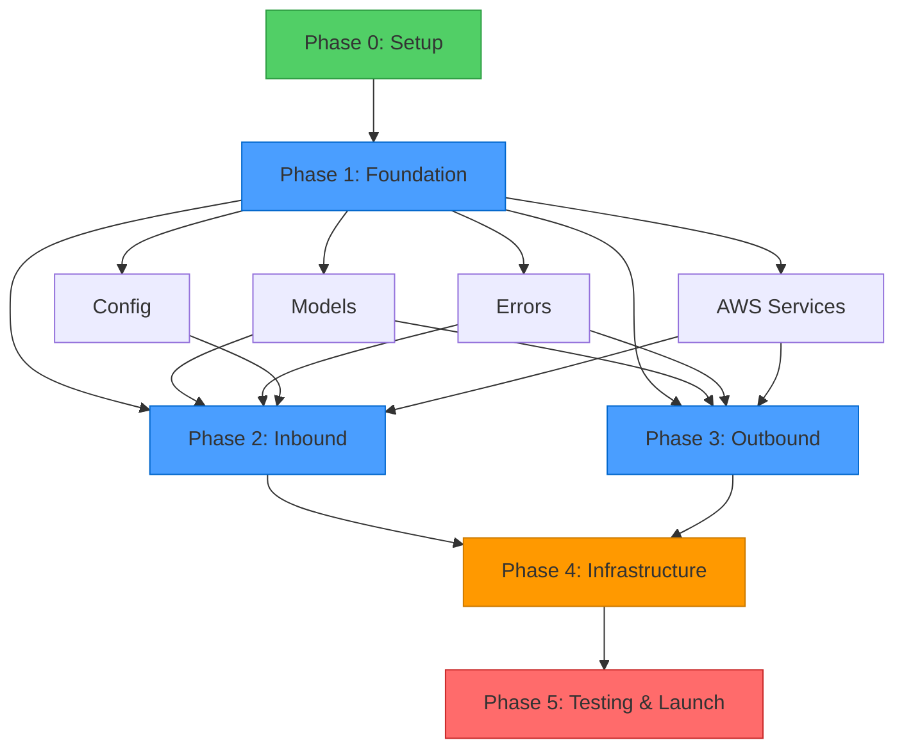

# Implementation Plan: Mailflow - Email Dispatching System

**Version:** 1.0
**Date:** 2025-10-31
**Status:** Draft
**Based on:** [0002-design.md](./0002-design.md)

## 1. Executive Summary

This document provides a detailed, phase-by-phase implementation plan for building the Mailflow email dispatching system. The implementation is broken down into 5 major phases over an estimated 4-6 weeks timeline.

### 1.1 Implementation Approach

- **Incremental Development**: Build and test each component independently
- **Test-Driven Development**: Write tests before/alongside implementation
- **Infrastructure First**: Set up AWS resources before application code
- **Continuous Integration**: Deploy and test frequently
- **Milestone-Based**: Clear checkpoints with acceptance criteria

### 1.2 Timeline Overview

| Phase                        | Duration | Deliverable                                      |
|------------------------------|----------|--------------------------------------------------|
| Phase 0: Project Setup       | 2-3 days | Development environment, CI/CD pipeline          |
| Phase 1: Foundation          | 4-5 days | Core models, error handling, AWS service clients |
| Phase 2: Inbound Processing  | 5-7 days | Email parsing, routing, S3/SQS integration       |
| Phase 3: Outbound Processing | 4-5 days | Email composition, SES sending, idempotency      |
| Phase 4: Infrastructure      | 3-4 days | Pulumi deployment, monitoring, alarms            |
| Phase 5: Testing & Launch    | 5-7 days | Integration tests, load tests, documentation     |

**Total Estimated Time**: 4-6 weeks (1 developer)

## 2. Phase 0: Project Setup (2-3 days)

### 2.1 Objectives

- Set up Rust project structure
- Configure development environment
- Set up CI/CD pipeline
- Establish coding standards

### 2.2 Tasks

#### Task 0.1: Initialize Rust Project
**Estimated Time**: 2-3 hours
**Dependencies**: None

**Steps**:
1. Update `Cargo.toml` with dependencies
2. Create module structure (as per design doc)
3. Set up workspace if needed
4. Configure build profiles (dev, release, lambda)

**Acceptance Criteria**:
- [ ] `cargo build` succeeds
- [ ] Module structure matches design spec
- [ ] Dependencies compile successfully

**Cargo.toml Updates**:
```toml
[package]
name = "mailflow"
version = "0.1.0"
edition = "2024"

[dependencies]
# AWS SDK
aws-config = "1.5"
aws-sdk-s3 = "1.55"
aws-sdk-sqs = "1.47"
aws-sdk-ses = "1.49"
aws-sdk-dynamodb = "1.51"

# Lambda Runtime
lambda_runtime = "0.13"
lambda_http = "0.13"
tokio = { version = "1.47", features = ["full"] }

# Email Processing (vendored)
mail-parser = { path = "./vendors/mail-parser" }
lettre = { path = "./vendors/lettre", features = ["builder", "tokio1-rustls-tls"] }

# Serialization
serde = { version = "1.0", features = ["derive"] }
serde_json = "1.0"

# Error Handling
thiserror = "2.0"
anyhow = "1.0"

# Logging
tracing = "0.1"
tracing-subscriber = { version = "0.3", features = ["json", "env-filter"] }

# Utilities
chrono = { version = "0.4", features = ["serde"] }
regex = "1.11"
bytes = "1.9"
mime = "0.3"
base64 = "0.22"
url = "2.5"
async-trait = "0.1"
futures = "0.3"

# Security
ammonia = "4.0"

[dev-dependencies]
tokio-test = "0.4"
mockall = "0.13"
wiremock = "0.6"

[profile.release]
opt-level = "z"
lto = true
codegen-units = 1
strip = true
panic = "abort"
```

#### Task 0.2: Set Up Development Tools
**Estimated Time**: 1-2 hours
**Dependencies**: Task 0.1

**Steps**:
1. Configure `rustfmt.toml`
2. Configure `clippy.toml`
3. Set up pre-commit hooks
4. Install `cargo-lambda` CLI
5. Create `Makefile` for common tasks

**Acceptance Criteria**:
- [ ] `cargo fmt` runs successfully
- [ ] `cargo clippy` passes with no warnings
- [ ] Pre-commit hooks execute
- [ ] `cargo lambda build` works

**Makefile**:
```makefile
.PHONY: build test lint fmt clean deploy

build:
	cargo build

test:
	cargo test

lint:
	cargo clippy -- -D warnings

fmt:
	cargo fmt --check

lambda-build:
	cargo lambda build --release --arm64

lambda-deploy:
	cd infra && pulumi up

clean:
	cargo clean
	rm -rf target/

check: fmt lint test

all: check build
```

#### Task 0.3: Set Up CI/CD Pipeline
**Estimated Time**: 3-4 hours
**Dependencies**: Task 0.1, 0.2

**Steps**:
1. Create GitHub Actions workflow (or similar)
2. Configure Rust toolchain
3. Add build, test, lint steps
4. Set up AWS credentials for deployment
5. Configure artifact caching

**Acceptance Criteria**:
- [ ] CI runs on every commit
- [ ] Tests run automatically
- [ ] Build produces Lambda-compatible binary
- [ ] Deployment to dev environment works

**GitHub Actions Workflow** (`.github/workflows/ci.yml`):
```yaml
name: CI

on:
  push:
    branches: [main, develop]
  pull_request:
    branches: [main]

jobs:
  test:
    runs-on: ubuntu-latest
    steps:
      - uses: actions/checkout@v4
      - uses: dtolnay/rust-toolchain@stable
      - uses: Swatinem/rust-cache@v2
      - run: cargo test --all-features
      - run: cargo clippy -- -D warnings
      - run: cargo fmt -- --check

  build:
    runs-on: ubuntu-latest
    needs: test
    steps:
      - uses: actions/checkout@v4
      - uses: dtolnay/rust-toolchain@stable
      - uses: cargo-lambda/setup-cargo-lambda@v3
      - run: cargo lambda build --release --arm64
      - uses: actions/upload-artifact@v4
        with:
          name: lambda-binary
          path: target/lambda/mailflow/bootstrap.zip
```

#### Task 0.4: Set Up Testing Framework
**Estimated Time**: 2-3 hours
**Dependencies**: Task 0.1

**Steps**:
1. Create test fixtures directory
2. Add sample email files for testing
3. Set up mock AWS services (LocalStack or mocks)
4. Create test utilities module

**Acceptance Criteria**:
- [ ] `cargo test` runs successfully
- [ ] Test fixtures loaded correctly
- [ ] Mock framework configured

**Test Structure**:
```
tests/
├── fixtures/
│   ├── emails/
│   │   ├── simple.eml
│   │   ├── with_attachments.eml
│   │   ├── multipart.eml
│   │   └── malformed.eml
│   └── messages/
│       ├── inbound.json
│       └── outbound.json
├── integration/
│   ├── test_inbound_flow.rs
│   └── test_outbound_flow.rs
└── common/
    └── mod.rs  // Test utilities
```

### 2.3 Deliverables

- [ ] Rust project with all dependencies
- [ ] Development environment configured
- [ ] CI/CD pipeline operational
- [ ] Testing framework ready
- [ ] Documentation started (README.md)

---

## 3. Phase 1: Foundation (4-5 days)

### 3.1 Objectives

- Implement core data models
- Build error handling framework
- Create AWS service clients
- Implement configuration loading

### 3.2 Tasks

#### Task 1.1: Implement Core Data Models
**Estimated Time**: 1 day
**Dependencies**: Phase 0

**Steps**:
1. Implement `models/email.rs` (Email, EmailAddress, EmailBody, Attachment)
2. Implement `models/messages.rs` (InboundMessage, OutboundMessage)
3. Implement `models/config.rs` (MailflowConfig, AppRouting)
4. Implement `models/events.rs` (LambdaEvent, S3Event, SqsEvent)
5. Add serde derives and validation

**Files to Create**:
- `src/models/mod.rs`
- `src/models/email.rs`
- `src/models/messages.rs`
- `src/models/config.rs`
- `src/models/events.rs`

**Acceptance Criteria**:
- [ ] All models compile
- [ ] Serde serialization/deserialization works
- [ ] Unit tests for each model
- [ ] Models match JSON schemas from design doc

**Example Test**:
```rust
#[cfg(test)]
mod tests {
    use super::*;

    #[test]
    fn test_email_address_serialization() {
        let addr = EmailAddress {
            address: "test@example.com".to_string(),
            name: Some("Test User".to_string()),
        };

        let json = serde_json::to_string(&addr).unwrap();
        let deserialized: EmailAddress = serde_json::from_str(&json).unwrap();

        assert_eq!(addr.address, deserialized.address);
        assert_eq!(addr.name, deserialized.name);
    }
}
```

#### Task 1.2: Implement Error Handling
**Estimated Time**: 4-6 hours
**Dependencies**: None

**Steps**:
1. Create `src/error.rs` with all error types
2. Implement `thiserror` derives
3. Add `is_retriable()` method for error classification
4. Create error conversion impls

**Files to Create**:
- `src/error.rs`

**Acceptance Criteria**:
- [ ] All error types defined
- [ ] Error messages are descriptive
- [ ] Retriable vs non-retriable classification works
- [ ] Error conversions compile

**Key Error Types**:
```rust
#[derive(thiserror::Error, Debug)]
pub enum MailflowError {
    #[error("Email parsing error: {0}")]
    EmailParsing(String),

    #[error("Routing error: {0}")]
    Routing(String),

    #[error("Storage error: {0}")]
    Storage(String),

    #[error("Queue error: {0}")]
    Queue(String),

    #[error("SES error: {0}")]
    Ses(String),

    #[error("Configuration error: {0}")]
    Config(String),

    #[error("Validation error: {0}")]
    Validation(String),

    #[error("Idempotency error: {0}")]
    Idempotency(String),
}
```

#### Task 1.3: Implement Configuration Service
**Estimated Time**: 4-6 hours
**Dependencies**: Task 1.1, 1.2

**Steps**:
1. Create `src/services/config.rs`
2. Implement `EnvConfigProvider` (loads from env vars)
3. Parse `ROUTING_MAP` JSON
4. Implement `ConfigProvider` trait
5. Add unit tests with mock env vars

**Files to Create**:
- `src/services/mod.rs`
- `src/services/config.rs`

**Acceptance Criteria**:
- [ ] Config loads from environment variables
- [ ] Invalid JSON handled gracefully
- [ ] Missing env vars produce clear errors
- [ ] Unit tests pass

#### Task 1.4: Implement AWS Service Clients
**Estimated Time**: 1-1.5 days
**Dependencies**: Task 1.1, 1.2

**Steps**:
1. Create `src/services/s3.rs` with S3Service trait and impl
2. Create `src/services/sqs.rs` with QueueService trait and impl
3. Create `src/services/ses.rs` with EmailSender trait and impl
4. Create `src/services/idempotency.rs` with IdempotencyService trait and impl
5. Add error handling and retries
6. Create mock implementations for testing

**Files to Create**:
- `src/services/s3.rs`
- `src/services/sqs.rs`
- `src/services/ses.rs`
- `src/services/idempotency.rs`

**Acceptance Criteria**:
- [ ] All service traits defined
- [ ] AWS SDK clients initialized correctly
- [ ] Basic operations work (upload, download, send, etc.)
- [ ] Mock implementations for testing
- [ ] Error handling works

**Example S3Service**:
```rust
#[async_trait]
pub trait StorageService: Send + Sync {
    async fn upload(&self, bucket: &str, key: &str, data: &[u8])
        -> Result<(), StorageError>;
    async fn download(&self, bucket: &str, key: &str)
        -> Result<Vec<u8>, StorageError>;
    async fn generate_presigned_url(&self, bucket: &str, key: &str, expiration: Duration)
        -> Result<String, StorageError>;
}

pub struct S3StorageService {
    client: aws_sdk_s3::Client,
}

impl S3StorageService {
    pub fn new(client: aws_sdk_s3::Client) -> Self {
        Self { client }
    }
}
```

#### Task 1.5: Implement Metrics and Logging
**Estimated Time**: 4-6 hours
**Dependencies**: Task 1.2

**Steps**:
1. Create `src/services/metrics.rs`
2. Set up `tracing` subscriber for structured logging
3. Implement `MetricsService` trait
4. Add CloudWatch metrics emission
5. Add helper macros for common logging patterns

**Files to Create**:
- `src/services/metrics.rs`

**Acceptance Criteria**:
- [ ] Structured logging configured
- [ ] Metrics can be recorded
- [ ] Log levels work (debug, info, warn, error)
- [ ] JSON output format

### 3.3 Deliverables

- [ ] Core data models implemented and tested
- [ ] Error handling framework complete
- [ ] Configuration service working
- [ ] AWS service clients functional
- [ ] Logging and metrics framework ready

---

## 4. Phase 2: Inbound Email Processing (5-7 days)

### 4.1 Objectives

- Implement email parsing using `mail-parser`
- Build routing engine
- Create inbound handler
- Integrate with S3 and SQS

### 4.2 Tasks

#### Task 2.1: Implement Email Parser
**Estimated Time**: 1-1.5 days
**Dependencies**: Phase 1

**Steps**:
1. Create `src/email/parser.rs`
2. Implement `EmailParser` trait using `mail-parser`
3. Extract headers, body (text/HTML), attachments
4. Handle character encodings
5. Validate email structure
6. Add comprehensive tests with fixture emails

**Files to Create**:
- `src/email/mod.rs`
- `src/email/parser.rs`
- `src/email/mime.rs`

**Acceptance Criteria**:
- [ ] Parse simple emails correctly
- [ ] Extract multipart/alternative bodies
- [ ] Extract attachments with metadata
- [ ] Handle various character encodings (UTF-8, ISO-8859-1)
- [ ] Gracefully handle malformed emails
- [ ] Unit tests with fixtures pass

**Test Cases**:
- Simple plain text email
- HTML email
- Multipart alternative (text + HTML)
- Email with attachments
- Email with inline images
- Malformed MIME structure
- Various character encodings

#### Task 2.2: Implement Attachment Handling
**Estimated Time**: 1 day
**Dependencies**: Task 2.1, Phase 1

**Steps**:
1. Create `src/email/attachment.rs`
2. Implement attachment extraction from parsed email
3. Upload attachments to S3
4. Generate presigned URLs
5. Validate file types and sizes
6. Sanitize filenames

**Files to Create**:
- `src/email/attachment.rs`

**Acceptance Criteria**:
- [ ] Attachments uploaded to S3 correctly
- [ ] Presigned URLs generated with correct expiration
- [ ] Filename sanitization works
- [ ] Duplicate filename handling (append suffix)
- [ ] File type validation works
- [ ] Size limits enforced

#### Task 2.3: Implement Routing Engine
**Estimated Time**: 1 day
**Dependencies**: Phase 1

**Steps**:
1. Create `src/routing/engine.rs`
2. Extract app name from recipient address (_app@domain.com)
3. Look up queue URL from config
4. Handle multiple recipients
5. Handle fallback to default queue
6. Add validation

**Files to Create**:
- `src/routing/mod.rs`
- `src/routing/engine.rs`
- `src/routing/rules.rs`
- `src/routing/resolver.rs`

**Acceptance Criteria**:
- [ ] Extract app name correctly (_app1@acme.com → app1)
- [ ] Resolve queue URL from config
- [ ] Handle multiple recipients (same app, different apps)
- [ ] Fallback to default queue for unknown apps
- [ ] Validation errors for invalid patterns
- [ ] Unit tests cover edge cases

**Test Cases**:
- Single recipient (_app1@acme.com)
- Multiple recipients (same app)
- Multiple recipients (different apps)
- No app prefix (regular@acme.com)
- Unknown app name
- Invalid email format

#### Task 2.4: Implement Inbound Handler
**Estimated Time**: 1.5-2 days
**Dependencies**: Task 2.1, 2.2, 2.3

**Steps**:
1. Create `src/handlers/inbound.rs`
2. Parse S3 event from SES
3. Download raw email from S3
4. Parse email
5. Process attachments (upload to S3)
6. Determine routing
7. Construct InboundMessage JSON
8. Send to target SQS queue(s)
9. Log metrics
10. Handle errors (send to DLQ)

**Files to Create**:
- `src/handlers/mod.rs`
- `src/handlers/inbound.rs`

**Acceptance Criteria**:
- [ ] S3 event parsed correctly
- [ ] Email downloaded and parsed
- [ ] Attachments uploaded to S3
- [ ] Routing determined correctly
- [ ] InboundMessage JSON correct
- [ ] Message sent to SQS
- [ ] Errors handled gracefully
- [ ] Metrics logged

**Handler Flow**:
```rust
pub async fn handle(event: S3Event, ctx: Context) -> Result<(), Error> {
    for record in event.records {
        let s3_key = &record.s3.object.key;

        // 1. Download raw email
        let raw_email = s3_service.download(bucket, s3_key).await?;

        // 2. Parse email
        let email = parser.parse(&raw_email).await?;

        // 3. Upload attachments
        let attachments = attachment_handler
            .process_attachments(&email).await?;

        // 4. Determine routing
        let routes = router.route(&email).await?;

        // 5. Send to queues
        for route in routes {
            let message = build_inbound_message(&email, &attachments, &route);
            sqs_service.send_message(&route.queue_url, &message).await?;
        }

        // 6. Log metrics
        metrics.record_counter("inbound_processed", 1.0, &[]);
    }

    Ok(())
}
```

#### Task 2.5: Integration Testing
**Estimated Time**: 1 day
**Dependencies**: Task 2.4

**Steps**:
1. Create integration tests for inbound flow
2. Use mock AWS services
3. Test end-to-end flow
4. Test error scenarios

**Files to Create**:
- `tests/integration/test_inbound_flow.rs`

**Acceptance Criteria**:
- [ ] End-to-end inbound flow works
- [ ] Attachments processed correctly
- [ ] Routing works for various scenarios
- [ ] Error handling tested
- [ ] DLQ handling tested

### 4.3 Deliverables

- [ ] Email parsing fully functional
- [ ] Attachment handling complete
- [ ] Routing engine working
- [ ] Inbound handler implemented
- [ ] Integration tests passing

---

## 5. Phase 3: Outbound Email Processing (4-5 days)

### 5.1 Objectives

- Implement email composition using `lettre`
- Build outbound handler
- Implement idempotency
- Integrate with SES

### 5.2 Tasks

#### Task 3.1: Implement Email Composer
**Estimated Time**: 1-1.5 days
**Dependencies**: Phase 1

**Steps**:
1. Create `src/email/composer.rs`
2. Implement `EmailComposer` trait using `lettre`
3. Build MIME emails from OutboundEmail
4. Create multipart/alternative structure
5. Encode attachments
6. Set standard headers (Message-ID, Date, etc.)
7. Preserve threading headers (In-Reply-To, References)

**Files to Create**:
- `src/email/composer.rs`

**Acceptance Criteria**:
- [ ] Compose plain text emails
- [ ] Compose HTML emails
- [ ] Compose multipart/alternative emails
- [ ] Attachments encoded correctly
- [ ] Headers set properly
- [ ] Threading headers preserved
- [ ] RFC 5322 compliant

**Test Cases**:
- Plain text email
- HTML email
- Text + HTML email
- Email with attachments
- Email with In-Reply-To header
- Email with custom headers

#### Task 3.2: Implement Idempotency Service
**Estimated Time**: 4-6 hours
**Dependencies**: Phase 1

**Steps**:
1. Implement `IdempotencyService` trait
2. Use DynamoDB for storage
3. Check correlation ID before processing
4. Record correlation ID after successful send
5. Implement TTL cleanup

**Files to Create**:
- `src/services/idempotency.rs` (already created, now implement)

**Acceptance Criteria**:
- [ ] Duplicate detection works
- [ ] TTL set correctly
- [ ] DynamoDB operations efficient
- [ ] Error handling robust

#### Task 3.3: Implement Outbound Handler
**Estimated Time**: 1.5-2 days
**Dependencies**: Task 3.1, 3.2

**Steps**:
1. Create `src/handlers/outbound.rs`
2. Receive messages from SQS
3. Validate OutboundMessage schema
4. Check idempotency (correlation ID)
5. Download attachments from S3 (if any)
6. Compose email
7. Check SES quota
8. Send via SES
9. Record idempotency
10. Delete from SQS
11. Handle errors (DLQ)

**Files to Create**:
- `src/handlers/outbound.rs`

**Acceptance Criteria**:
- [ ] SQS messages received
- [ ] Schema validation works
- [ ] Idempotency check prevents duplicates
- [ ] Email composed correctly
- [ ] SES quota checked
- [ ] Email sent successfully
- [ ] Message deleted from queue
- [ ] Errors sent to DLQ
- [ ] Metrics logged

**Handler Flow**:
```rust
pub async fn handle(event: SqsEvent, ctx: Context) -> Result<(), Error> {
    for record in event.records {
        let message: OutboundMessage = serde_json::from_str(&record.body)?;

        // 1. Validate schema
        validate_outbound_message(&message)?;

        // 2. Check idempotency
        if idempotency.check(&message.correlation_id).await? {
            // Already processed, skip
            sqs.delete_message(&queue_url, &record.receipt_handle).await?;
            continue;
        }

        // 3. Download attachments
        let attachments = download_attachments(&message.email.attachments).await?;

        // 4. Compose email
        let raw_email = composer.compose(&message.email, &attachments).await?;

        // 5. Check quota
        let quota = ses.get_send_quota().await?;
        if quota.remaining < 1 {
            return Err(MailflowError::Ses("Quota exceeded".into()));
        }

        // 6. Send email
        let message_id = ses.send_raw_email(&raw_email).await?;

        // 7. Record idempotency
        idempotency.record(&message.correlation_id, Duration::from_secs(86400)).await?;

        // 8. Delete from queue
        sqs.delete_message(&queue_url, &record.receipt_handle).await?;

        // 9. Log metrics
        metrics.record_counter("outbound_sent", 1.0, &[]);
    }

    Ok(())
}
```

#### Task 3.4: Implement Validation and Sanitization
**Estimated Time**: 4-6 hours
**Dependencies**: Phase 1

**Steps**:
1. Create `src/utils/validation.rs`
2. Implement email address validation
3. Implement attachment validation
4. Create `src/utils/sanitization.rs`
5. Implement HTML sanitization
6. Implement filename sanitization

**Files to Create**:
- `src/utils/mod.rs`
- `src/utils/validation.rs`
- `src/utils/sanitization.rs`

**Acceptance Criteria**:
- [ ] Email address validation works
- [ ] File type validation works
- [ ] Size limits enforced
- [ ] HTML sanitized (XSS prevention)
- [ ] Filenames sanitized (path traversal prevention)

#### Task 3.5: Integration Testing
**Estimated Time**: 1 day
**Dependencies**: Task 3.3

**Steps**:
1. Create integration tests for outbound flow
2. Test end-to-end flow with mocks
3. Test idempotency
4. Test error scenarios

**Files to Create**:
- `tests/integration/test_outbound_flow.rs`

**Acceptance Criteria**:
- [ ] End-to-end outbound flow works
- [ ] Idempotency prevents duplicates
- [ ] Email composition correct
- [ ] SES integration works (mocked)
- [ ] Error handling tested

### 5.3 Deliverables

- [ ] Email composer functional
- [ ] Idempotency service working
- [ ] Outbound handler implemented
- [ ] Validation and sanitization complete
- [ ] Integration tests passing

---

## 6. Phase 4: Infrastructure (3-4 days)

### 6.1 Objectives

- Set up Pulumi infrastructure
- Deploy Lambda function
- Configure SES, S3, SQS, DynamoDB
- Set up monitoring and alarms

### 6.2 Tasks

#### Task 4.1: Initialize Pulumi Project
**Estimated Time**: 2-3 hours
**Dependencies**: None

**Steps**:
1. Create `infra/` directory
2. Initialize Pulumi TypeScript project
3. Set up project structure
4. Configure dev and prod stacks
5. Create app configuration files

**Files to Create**:
```
infra/
├── Pulumi.yaml
├── Pulumi.dev.yaml
├── Pulumi.prod.yaml
├── package.json
├── tsconfig.json
├── config/
│   ├── apps.dev.json
│   └── apps.prod.json
└── src/
    ├── index.ts
    ├── storage.ts
    ├── queues.ts
    ├── database.ts
    ├── lambda.ts
    ├── ses.ts
    ├── monitoring.ts
    └── iam.ts
```

**Acceptance Criteria**:
- [ ] Pulumi project initialized
- [ ] TypeScript compilation works
- [ ] Stack configuration valid

#### Task 4.2: Implement Storage Resources (S3)
**Estimated Time**: 2-3 hours
**Dependencies**: Task 4.1

**Steps**:
1. Create `infra/src/storage.ts`
2. Define S3 bucket for raw emails
3. Configure lifecycle policies (7-day expiration)
4. Enable encryption (KMS)
5. Set up bucket policies

**Acceptance Criteria**:
- [ ] S3 bucket created
- [ ] Lifecycle policy configured
- [ ] Encryption enabled
- [ ] Permissions correct

#### Task 4.3: Implement Queue Resources (SQS)
**Estimated Time**: 3-4 hours
**Dependencies**: Task 4.1

**Steps**:
1. Create `infra/src/queues.ts`
2. Load app config from JSON
3. Create app queues dynamically
4. Create outbound queue
5. Create DLQ
6. Create default queue
7. Configure queue settings (visibility timeout, retention)

**Acceptance Criteria**:
- [ ] All queues created
- [ ] Queue settings correct
- [ ] DLQ configured
- [ ] Dynamic queue creation works

#### Task 4.4: Implement Database Resources (DynamoDB)
**Estimated Time**: 1-2 hours
**Dependencies**: Task 4.1

**Steps**:
1. Create `infra/src/database.ts`
2. Create idempotency table
3. Configure TTL
4. Set billing mode (PAY_PER_REQUEST)

**Acceptance Criteria**:
- [ ] Idempotency table created
- [ ] TTL enabled
- [ ] Billing mode correct

#### Task 4.5: Implement Lambda Function
**Estimated Time**: 4-6 hours
**Dependencies**: Task 4.2, 4.3, 4.4, Phase 3

**Steps**:
1. Create `infra/src/lambda.ts`
2. Build routing map from app queues
3. Configure environment variables
4. Set up IAM role and policies
5. Deploy Lambda function
6. Configure S3 event trigger (SES)
7. Configure SQS event source (outbound queue)

**Acceptance Criteria**:
- [ ] Lambda function deployed
- [ ] Environment variables set correctly
- [ ] IAM permissions work
- [ ] S3 trigger configured
- [ ] SQS event source configured
- [ ] Function executes successfully

#### Task 4.6: Implement SES Configuration
**Estimated Time**: 2-3 hours
**Dependencies**: Task 4.5

**Steps**:
1. Create `infra/src/ses.ts`
2. Verify domain(s)
3. Create receipt rule set
4. Configure S3 action (save email)
5. Configure Lambda action (trigger function)
6. Activate rule set

**Acceptance Criteria**:
- [ ] Domains verified
- [ ] Receipt rules configured
- [ ] Email saving to S3 works
- [ ] Lambda triggered on email receipt

#### Task 4.7: Implement Monitoring and Alarms
**Estimated Time**: 3-4 hours
**Dependencies**: Task 4.5

**Steps**:
1. Create `infra/src/monitoring.ts`
2. Create CloudWatch log groups
3. Configure log retention
4. Create alarms:
   - Lambda errors > threshold
   - DLQ message count > 0
   - Queue depth > threshold
   - SES bounce rate > 5%
5. Configure SNS topics for alerts (optional)

**Acceptance Criteria**:
- [ ] Log groups created
- [ ] Alarms configured
- [ ] Alarms trigger correctly
- [ ] Notifications work (if configured)

#### Task 4.8: Deploy and Test Infrastructure
**Estimated Time**: 4-6 hours
**Dependencies**: All Task 4.x

**Steps**:
1. Deploy to dev environment (`pulumi up`)
2. Verify all resources created
3. Test S3 bucket access
4. Test queue operations
5. Test Lambda invocation
6. Test SES email reception
7. Verify monitoring works

**Acceptance Criteria**:
- [ ] All resources deployed successfully
- [ ] No deployment errors
- [ ] Resources accessible
- [ ] Lambda can access all services
- [ ] End-to-end flow works

### 6.3 Deliverables

- [ ] Complete Pulumi infrastructure code
- [ ] All AWS resources deployed
- [ ] Lambda function running
- [ ] Monitoring and alarms active
- [ ] Infrastructure documented

---

## 7. Phase 5: Testing & Launch (5-7 days)

### 7.1 Objectives

- Comprehensive end-to-end testing
- Load testing
- Security testing
- Documentation
- Production deployment

### 7.2 Tasks

#### Task 5.1: End-to-End Testing
**Estimated Time**: 1-2 days
**Dependencies**: Phase 4

**Steps**:
1. Test inbound flow end-to-end
   - Send real email to SES
   - Verify email parsed correctly
   - Verify routing works
   - Verify message in correct queue
2. Test outbound flow end-to-end
   - Send message to outbound queue
   - Verify email composed correctly
   - Verify email sent via SES
   - Verify idempotency works
3. Test error scenarios
   - Malformed emails
   - Invalid routing
   - SES failures
   - DLQ handling
4. Test edge cases (from spec)

**Acceptance Criteria**:
- [ ] Inbound flow works for all scenarios
- [ ] Outbound flow works for all scenarios
- [ ] Error handling works correctly
- [ ] All edge cases handled
- [ ] No data loss

#### Task 5.2: Load Testing
**Estimated Time**: 1 day
**Dependencies**: Task 5.1

**Steps**:
1. Create load testing script
2. Test 100 emails/minute sustained
3. Test 1000 emails/minute burst
4. Test large attachments (35 MB)
5. Monitor performance metrics
6. Identify bottlenecks
7. Optimize if needed

**Tools**:
- Custom Rust script using `tokio`
- AWS SES SendEmail API
- CloudWatch metrics

**Acceptance Criteria**:
- [ ] Handles 100 emails/min sustained
- [ ] Handles 1000 emails/min burst
- [ ] Large attachments work
- [ ] Performance within SLA (5s p95)
- [ ] No errors under load

#### Task 5.3: Security Testing
**Estimated Time**: 1 day
**Dependencies**: Task 5.1

**Steps**:
1. Test SPF/DKIM validation
2. Test XSS prevention (HTML sanitization)
3. Test path traversal prevention (filename sanitization)
4. Test file type validation
5. Test rate limiting
6. Run `cargo audit` for dependencies
7. Review IAM permissions (least privilege)
8. Test presigned URL expiration

**Acceptance Criteria**:
- [ ] Security validations work
- [ ] No XSS vulnerabilities
- [ ] No path traversal vulnerabilities
- [ ] File types validated
- [ ] No vulnerable dependencies
- [ ] IAM follows least privilege
- [ ] Presigned URLs expire correctly

#### Task 5.4: Documentation
**Estimated Time**: 1-1.5 days
**Dependencies**: Phase 4

**Steps**:
1. Update README.md
   - Project overview
   - Architecture diagram
   - Setup instructions
   - Deployment guide
2. Create CONTRIBUTING.md
3. Document API/message schemas
4. Create runbooks:
   - Deployment procedure
   - Troubleshooting guide
   - Monitoring guide
   - Rollback procedure
5. Add code comments and docstrings

**Files to Create/Update**:
- `README.md`
- `CONTRIBUTING.md`
- `docs/API.md`
- `docs/DEPLOYMENT.md`
- `docs/TROUBLESHOOTING.md`
- `docs/MONITORING.md`

**Acceptance Criteria**:
- [ ] README comprehensive
- [ ] Setup instructions work
- [ ] Deployment guide complete
- [ ] Runbooks detailed
- [ ] Code well-documented

#### Task 5.5: Performance Optimization
**Estimated Time**: 1 day
**Dependencies**: Task 5.2

**Steps**:
1. Review load test results
2. Optimize Lambda memory allocation
3. Optimize binary size
4. Implement connection pooling
5. Optimize S3/SQS batch operations
6. Profile code for bottlenecks
7. Re-run load tests

**Acceptance Criteria**:
- [ ] Lambda cold start < 2s
- [ ] Processing time within SLA
- [ ] Binary size optimized
- [ ] Resource usage efficient

#### Task 5.6: Production Deployment
**Estimated Time**: 4-6 hours
**Dependencies**: All Task 5.x

**Steps**:
1. Create production Pulumi stack
2. Configure production app queues
3. Verify production SES domain
4. Deploy to production
5. Run smoke tests
6. Monitor for 24 hours
7. Document deployment

**Acceptance Criteria**:
- [ ] Production deployment successful
- [ ] Smoke tests pass
- [ ] No errors in first 24 hours
- [ ] Monitoring working
- [ ] Deployment documented

#### Task 5.7: Launch Checklist
**Estimated Time**: 2-3 hours
**Dependencies**: Task 5.6

**Checklist**:
- [ ] All tests passing
- [ ] Documentation complete
- [ ] Monitoring configured
- [ ] Alarms set up
- [ ] DLQ monitored
- [ ] Runbooks ready
- [ ] On-call rotation defined
- [ ] Rollback procedure tested
- [ ] Stakeholders notified
- [ ] Go-live approved

### 7.3 Deliverables

- [ ] All tests passing (unit, integration, load, security)
- [ ] Complete documentation
- [ ] Production deployment successful
- [ ] Monitoring and alerting active
- [ ] System ready for production traffic

---

## 8. Post-Launch Tasks

### 8.1 Week 1 Post-Launch

**Monitoring**:
- [ ] Monitor error rates daily
- [ ] Review CloudWatch logs for issues
- [ ] Check DLQ for failed messages
- [ ] Monitor SES bounce/complaint rates
- [ ] Track performance metrics

**Optimization**:
- [ ] Analyze real-world usage patterns
- [ ] Optimize based on actual load
- [ ] Fine-tune Lambda memory/timeout

**Documentation**:
- [ ] Document any issues found
- [ ] Update troubleshooting guide
- [ ] Create FAQ

### 8.2 Week 2-4 Post-Launch

**Enhancements**:
- [ ] Implement feedback from users
- [ ] Add missing features
- [ ] Optimize costs
- [ ] Improve monitoring dashboards

**Stability**:
- [ ] Address any bugs
- [ ] Improve error handling
- [ ] Enhance logging

---

## 9. Risk Mitigation

### 9.1 Technical Risks

| Risk                           | Probability | Impact | Mitigation                                        |
|--------------------------------|-------------|--------|---------------------------------------------------|
| AWS Lambda cold start too slow | Medium      | Medium | Use provisioned concurrency, optimize binary size |
| SES rate limits exceeded       | Low         | High   | Implement rate limiting, queue throttling         |
| S3 storage costs high          | Low         | Medium | Implement lifecycle policies, monitor usage       |
| Email parsing failures         | Medium      | Medium | Comprehensive error handling, fallback to DLQ     |
| Idempotency failures           | Low         | High   | Thorough testing, DynamoDB backups                |
| Security vulnerabilities       | Medium      | High   | Regular security audits, dependency updates       |

### 9.2 Project Risks

| Risk                | Probability | Impact | Mitigation                                        |
|---------------------|-------------|--------|---------------------------------------------------|
| Timeline slippage   | Medium      | Medium | Buffer time in estimates, prioritize MVP          |
| Scope creep         | Medium      | Medium | Strict adherence to spec, defer enhancements      |
| Dependency issues   | Low         | Medium | Use vendored crates, lock versions                |
| AWS service outages | Low         | High   | Multi-region deployment (future), good monitoring |

---

## 10. Success Criteria

### 10.1 Functional Criteria

- [ ] System processes 100+ emails/minute
- [ ] Email parsing accuracy > 99%
- [ ] Routing accuracy 100%
- [ ] Zero data loss
- [ ] Idempotency works 100%

### 10.2 Non-Functional Criteria

- [ ] P95 latency < 5s (inbound)
- [ ] P95 latency < 10s (outbound)
- [ ] Error rate < 1%
- [ ] Uptime > 99.9%
- [ ] Cost < $5/month for 10k emails (serverless efficiency)

### 10.3 Quality Criteria

- [ ] Test coverage > 80%
- [ ] No critical security vulnerabilities
- [ ] Code passes all lints
- [ ] Documentation complete
- [ ] CI/CD pipeline operational

---

## 11. Appendix

### 11.1 Task Dependencies Diagram



### 11.2 Time Tracking Template

| Phase     | Task           | Estimated      | Actual | Notes |
|-----------|----------------|----------------|--------|-------|
| 0         | Setup          | 2-3 days       |        |       |
| 1         | Foundation     | 4-5 days       |        |       |
| 2         | Inbound        | 5-7 days       |        |       |
| 3         | Outbound       | 4-5 days       |        |       |
| 4         | Infrastructure | 3-4 days       |        |       |
| 5         | Testing        | 5-7 days       |        |       |
| **Total** |                | **23-31 days** |        |       |

### 11.3 Resource Requirements

**Development**:
- 1 Senior Rust Developer (full-time)
- 1 DevOps Engineer (part-time, 25%)
- 1 QA Engineer (part-time, 50%, last 2 weeks)

**Infrastructure**:
- AWS Account with SES enabled
- Domain for email testing
- Development and production environments

**Tools**:
- Rust toolchain (latest stable)
- Pulumi CLI
- AWS CLI
- Git
- IDE (VSCode/RustRover recommended)

### 11.4 Cost Breakdown (Serverless Architecture)

**Monthly Cost Estimate (10,000 emails/month)**:

| Service             | Usage                                                                                                          | Cost             |
|---------------------|----------------------------------------------------------------------------------------------------------------|------------------|
| **Lambda**          | ~20,000 invocations (10k inbound + 10k outbound)<br>256 MB memory, 2s avg duration<br>5.12 GB-seconds          | $0.10            |
| **S3**              | Raw emails: 1 GB storage (7-day retention)<br>Attachments: 5 GB (30-day retention)<br>PUT/GET: 40,000 requests | $0.30            |
| **SQS**             | 40,000 requests (20k send + 20k receive)                                                                       | $0.02            |
| **DynamoDB**        | Idempotency table<br>10,000 writes, 100 reads<br>On-demand pricing                                             | $1.25            |
| **SES**             | 10,000 emails received: $0<br>10,000 emails sent: $1.00                                                        | $1.00            |
| **CloudWatch Logs** | 1 GB logs, 7-day retention                                                                                     | $0.50            |
| **Data Transfer**   | Minimal (mostly within region)                                                                                 | $0.10            |
| **TOTAL**           |                                                                                                                | **~$3.27/month** |

**Monthly Cost Estimate (100,000 emails/month)**:

| Service         | Usage                                | Cost              |
|-----------------|--------------------------------------|-------------------|
| Lambda          | 200,000 invocations, 51.2 GB-seconds | $1.00             |
| S3              | 10 GB storage, 400,000 requests      | $2.00             |
| SQS             | 400,000 requests                     | $0.16             |
| DynamoDB        | 100,000 writes, 1,000 reads          | $12.50            |
| SES             | 100,000 emails sent                  | $10.00            |
| CloudWatch Logs | 5 GB logs                            | $2.50             |
| Data Transfer   | Minimal                              | $0.50             |
| **TOTAL**       |                                      | **~$28.66/month** |

**Free Tier Benefits (First 12 months)**:
- Lambda: 1M requests/month FREE
- S3: 5 GB storage, 20,000 GET requests FREE
- SQS: 1M requests FREE
- DynamoDB: 25 GB storage FREE
- SES: 1,000 emails/month FREE (if sending from EC2, otherwise $0.10/1000)

**Realistic Production Cost**:
- **Light usage** (1,000 emails/month): **~$0.50/month** (mostly SES)
- **Moderate usage** (10,000 emails/month): **~$3-5/month**
- **Heavy usage** (100,000 emails/month): **~$25-30/month**
- **Enterprise usage** (1M emails/month): **~$200-250/month**

**Development Environment Cost**:
- Nearly **$0** (under free tier limits for testing)

**Notes**:
- Serverless = pay only for what you use
- No idle costs (unlike EC2/ECS)
- Automatic scaling included
- DynamoDB is the largest cost component (consider switching to provisioned capacity for predictable workloads)
- SES is $0.10 per 1,000 emails sent/received (very cheap)

---

**Document Approval**

| Role             | Name | Date | Signature |
|------------------|------|------|-----------|
| Engineering Lead |      |      |           |
| Project Manager  |      |      |           |
| QA Lead          |      |      |           |
